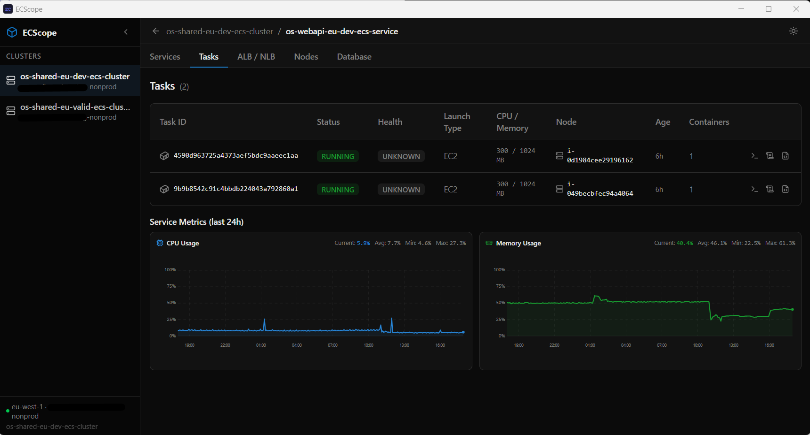

# ECScope

> **Deep visibility into your AWS ECS workloads**

ECScope is a modern, cross-platform desktop application for exploring, monitoring, and managing your Amazon ECS infrastructure. It gives you a clear, real-time view of your clusters, services, tasks, load balancers, nodes, and databases — all in one place.



## ✨ Features

- **Cluster Explorer** — Browse clusters, services, and tasks with intuitive navigation
- **Service Viewer** — Monitor status, desired/running tasks, CPU & memory usage; one-click scale up/down
- **Task Inspector** — View task details, container health, environment variables
- **Live Logs** — Stream and search CloudWatch logs in real time
- **ALB / NLB Viewer** — Inspect load balancers, target groups, health checks, and metrics
- **Node Viewer** — See EC2 container instances, resource usage, and running tasks
- **Database Dashboard** — Monitor RDS/Aurora CPU, memory, connections, and performance insights
- **Diagnostics** — Coredump, tcpdump, file download/upload via SSM + S3


## 🚀 Getting Started

### Prerequisites

| Tool | Install |
|------|---------|
| **AWS CLI** | `msiexec.exe /i https://awscli.amazonaws.com/AWSCLIV2.msi` |
| **SSM Plugin** | `winget install Amazon.SessionManagerPlugin` |

You also need valid AWS credentials in `~/.aws/credentials` and `~/.aws/config`.

### Installation

In Release section, download the latest release 


### Configuration

Create an `ecscope.config.json` file at the project root:

```json
{
    "refreshPeriodSeconds": 10,
    "clusters": [
        {
            "profile": "my-profile1",
            "region": "eu-west-1",
            "clusterName": "my-cluster"
        }
    ],
    "storage": {
        "s3Bucket": "my-diagnostics-bucket",
        "s3AccessKeyId": "AKIA...",
        "s3SecretAccessKey": "wJalr...",
        "s3Region": "eu-west-1"
    }
}
```

### Cluster configuration

| Field | Description |
|-------|-------------|
| `profile` | AWS profile name matching a `[profile]` entry in `~/.aws/config` |
| `region` | AWS region of the cluster |
| `clusterName` | Name of the ECS cluster as shown in the AWS console |

### Storage configuration (optional)

The `storage` section enables diagnostics features (coredump, tcpdump, file download/upload). ECScope uses S3 as temporary storage to transfer files to and from EC2 instances. The configured bucket must be accessible from your EC2 instances.

## 🚀 Developement

### Prerequisites

| Tool | Install |
|------|---------|
| **Node.js** | https://nodejs.org/en/download |
| **Rust** | https://rustup.rs/ |

### Build for development

```bash
git clone https://github.com/o0Zz/ECScope.git
cd ECScope
npm ci
npx tauri dev
```

### Build for production

```bash
npx tauri build
```

## 📁 Project Structure

```
src/
├── api/            # AWS SDK clients and API calls
├── components/     # Shared UI components
├── config/         # AWS credentials and app configuration
├── features/       # Feature modules (services, tasks, albnlb, nodes, database)
├── layout/         # App shell (sidebar, tabs, breadcrumb)
├── lib/            # Utilities and helpers
└── store/          # Zustand state stores
src-tauri/          # Tauri/Rust backend
```
