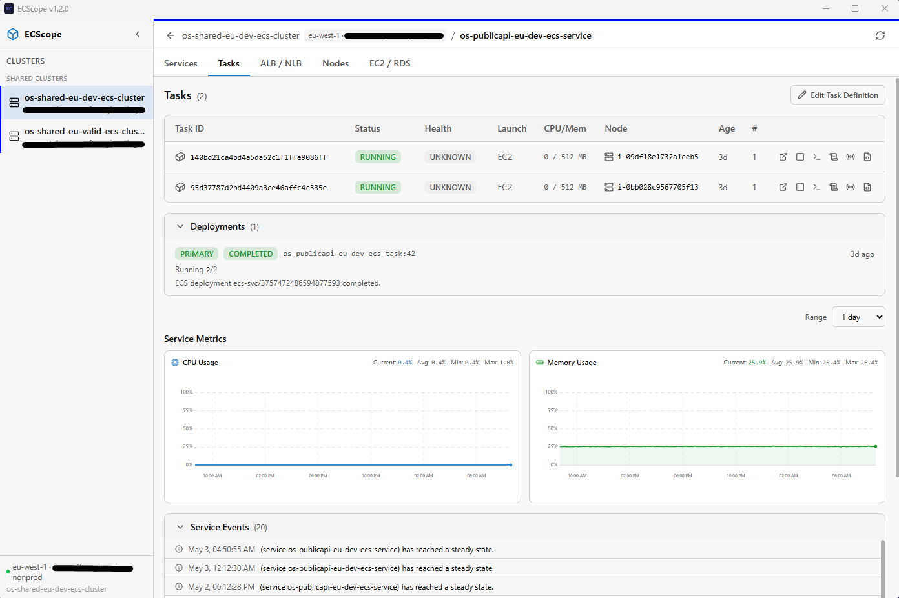

# ECScope

> **Deep visibility into your AWS ECS clusters**

ECScope is a modern, cross-platform desktop application for exploring, monitoring, and managing your Amazon ECS infrastructure. It gives you a clear, real-time view of your clusters, services, tasks, load balancers, nodes, and databases — all in one place.



## ✨ Features

- **Cluster Explorer** — Browse and connect to multiple clusters with group/color/icon customization
- **Service Viewer** — Monitor status, CPU & memory usage; one-click scale up/down, force deploy, autoscaling controls
- **Task Inspector** — View task details, container health, environment variables & secrets; ECS exec shell, live container logs, HTTP traffic capture
- **Task Definition Editor** — Edit task definitions as JSON with validation and one-click deploy
- **Secret Management** — View and edit secret values in Secrets Manager, redeploy on change
- **ALB / NLB Viewer** — Inspect load balancers, target groups, health checks, and request/latency/error metrics
- **Node Viewer** — EC2 container instances, SSM terminal, SFTP file transfer, ASG scaling controls
- **EC2 / RDS Dashboard** — VPC-filtered EC2 and RDS instances with CloudWatch metrics
- **Deployment Management** — View deployment history with rollback capability
- **Metrics Charting** — CloudWatch metrics with configurable time ranges (service, ALB, NLB, EC2, RDS)
- **Auto-Update** — Checks for new versions and notifies in sidebar
- **i18n** — English and English with emoji status prefixes


## 🚀 Getting Started

### Prerequisites

| Tool | Install |
|------|---------|
| **AWS CLI** | `msiexec.exe /i https://awscli.amazonaws.com/AWSCLIV2.msi` |
| **SSM Plugin** | `winget install Amazon.SessionManagerPlugin` |

You need valid AWS credentials in `~/.aws/credentials` and `~/.aws/config`. STS role assumption (`role_arn` + `source_profile`) is supported.

### Installation

Download the latest release from the [Releases](https://github.com/o0Zz/ECScope/releases) page (Windows NSIS/MSI, macOS DMG, Linux DEB/AppImage/RPM).


### Configuration

Create an `ecscope.config.json` file next to the executable (or in the current working directory):

```json
{
    "refreshPeriodSeconds": 10,
    "theme": "dark",
    "language": "en",
    "updateUrl": "https://raw.githubusercontent.com/o0Zz/ECScope/main/latest.json",
    "clusters": [
        {
            "profile": "my-profile1",
            "region": "eu-west-1",
            "clusterName": "my-cluster",
            "color": "0000ff",
            "group": "Production",
            "icon": "🚀"
        }
    ]
}
```

### Global configuration

| Field | Description |
|-------|-------------|
| `refreshPeriodSeconds` | Polling interval for data refresh (seconds) |
| `theme` | `dark` or `light` |
| `language` | Locale code: `en` or `en-emoji` |
| `updateUrl` | URL to `latest.json` for auto-update checks (optional) |

### Cluster configuration

| Field | Description |
|-------|-------------|
| `profile` | AWS profile name matching a `[profile]` entry in `~/.aws/config` |
| `region` | AWS region of the cluster |
| `clusterName` | Name of the ECS cluster as shown in the AWS console |
| `color` | Hex color code for sidebar display (optional) |
| `group` | Group name for organizing clusters in sidebar (optional) |
| `icon` | Emoji or text icon displayed next to cluster name (optional) |


## 🚀 Development

### Prerequisites

| Tool | Install |
|------|---------|
| **Node.js 22+** | https://nodejs.org/en/download |
| **Rust (stable)** | https://rustup.rs/ |

### Build for development

```bash
git clone https://github.com/o0Zz/ECScope.git
cd ECScope
npm ci
npx tauri dev
```

### Build for production

```bash
npx tauri build
```

### Fix ESLint 

```bash
npm run lint:fix
```

## 📁 Project Structure

```
src/
├── api/            # AWS SDK clients and domain API modules
├── components/     # Shared UI components (charts, dialogs, badges)
├── config/         # AWS credentials (with STS role assumption) and app configuration
├── features/       # Feature modules (services, tasks, albnlb, nodes, ec2rds, welcome)
├── i18n/           # Internationalization (en, en-emoji)
├── layout/         # App shell (sidebar, tabs, breadcrumb)
├── lib/            # Utilities, formatters, logger, update checker
└── store/          # Zustand state stores (config, navigation)
src-tauri/          # Tauri/Rust backend (config, SSM, ECS exec, SFTP)
```
